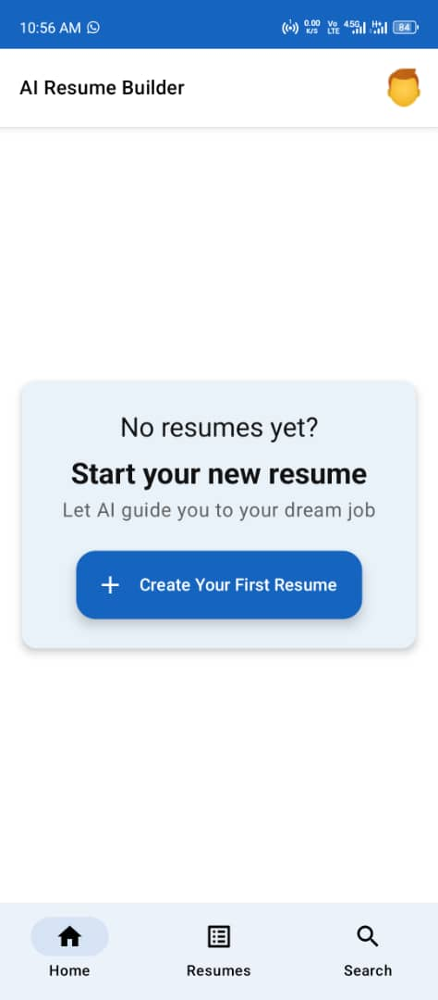
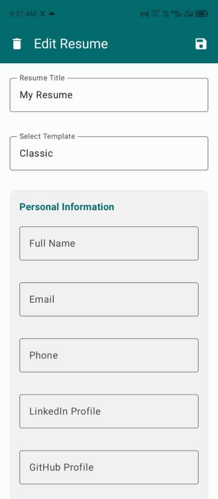
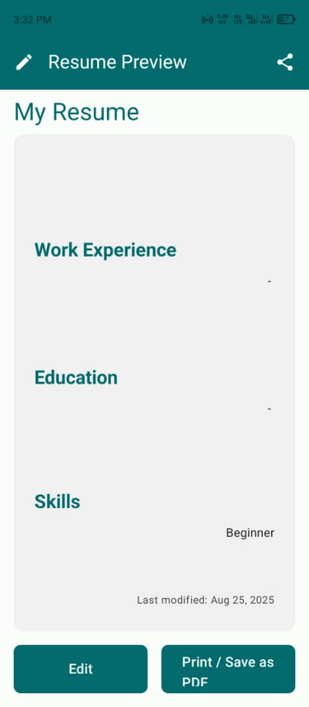

# AI Resume Builder App

An Android application designed to help users create, edit, and enhance their resumes using Artificial Intelligence. This app allows users to input their personal information, work experience, education, skills, projects, and certifications, and leverage AI capabilities to refine descriptions and generate professional summaries.


## Screenshots

| Home Screen | Form Screen | Resume Preview                               |
|-------------|-------------|----------------------------------------------|
|  |  |  |
| Dashboard for managing your resumes. | Input and edit your resume details. | Final formatted resume display.              |

---


## Features

*   **Resume Creation & Management:** Create, save, edit, and delete multiple resume profiles.
*   **Personal Information:** Comprehensive section for contact details, social links (LinkedIn, GitHub), and professional summary.
*   **AI-Powered Summary Generation:** Automatically generate a compelling professional summary based on provided experience and skills.
*   **AI-Powered Experience Description Improvement:** Get AI suggestions to refine and make work experience descriptions more impactful.
*   **Sections:** Dedicated sections for Work Experience, Education, Skills, Projects, and Certifications.
*   **Resume Preview:** View a formatted preview of the resume.
*   **Export to PDF:** Generate and share a PDF version of the resume.
*   **Theming:** Supports light and dark mode, respecting device system settings.

## Technologies Used

*   **Kotlin:** Primary programming language.
*   **Jetpack Compose:** Modern Android UI toolkit.
*   **Android Jetpack:**
    *   **Room:** Persistence library for local database storage.
    *   **ViewModel & LiveData/Flow:** Architecture components for UI-related data.
    *   **Navigation Compose:** For navigating between screens.
*   **Google Gemini API:** For AI functionalities (summary generation, description improvement).
*   **Kotlinx Serialization:** For efficient JSON serialization/deserialization.
*   **Gradle Kotlin DSL:** For build configuration.
*   **iText7:** For PDF generation.

## Setup and Installation

### Prerequisites

*   Android Studio (Bumblebee or later recommended)
*   Android SDK 34 (or target API level)
*   A Gemini API Key (see 'Getting Started with Gemini API' below)

### Getting Started

1.  **Clone the repository:**
    ```bash
    git clone https://github.com/KilaBean/AIResumeApp.git
    cd AIResumeApp
    ```

2.  **Obtain a Gemini API Key:**
    *   Visit the Google AI Studio: [https://aistudio.google.com/](https://aistudio.google.com/)
    *   Create a new API key.

3.  **Configure API Key Locally:**
    *   In the root directory of your project (same level as `app` folder), create a file named `local.properties` if it doesn't already exist.
    *   Add your Gemini API key to this file:
        ```properties
        gemini_api_key=YOUR_GEMINI_API_KEY_HERE
        ```
        **Replace `YOUR_GEMINI_API_KEY_HERE` with the actual key you obtained.** This file is excluded from version control by `.gitignore` for security.

4.  **Open in Android Studio:**
    *   Open the project in Android Studio.
    *   Allow Gradle to sync. If you encounter any issues, perform a `File -> Invalidate Caches / Restart...` and then `Build -> Clean Project` followed by `Build -> Rebuild Project`.

5.  **Run the App:**
    *   Connect an Android device or start an emulator.
    *   Click the 'Run' button in Android Studio.

## Usage

*   **Home Screen:** View a list of your saved resumes.
*   **Create New Resume:** Click the '+' button to start a new resume.
*   **Edit Resume:** Tap on an existing resume to modify its details.
*   **AI Features:** Look for "Generate Summary" and "Improve Description" buttons within the form sections.
*   **Preview & Export:** Access the preview screen to see the final layout and export your resume as a PDF.

## Contributing

Contributions are welcome! If you find a bug or have a feature request, please open an issue.

## License

(Optional: Add license information here, e.g., MIT License)

## Contact

*   [Your GitHub Profile](https://github.com/KilaBean)